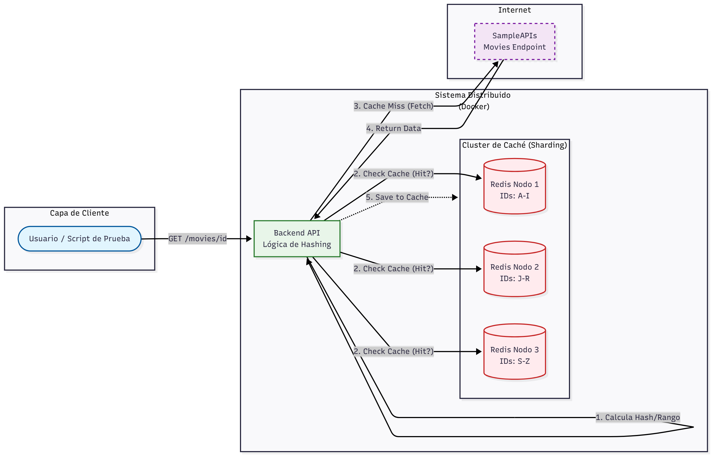

# ⚡ Distributed Cache System: Motor de Búsqueda de Alto Rendimiento

> **Sistema de búsqueda distribuido con implementación de caché particionado (Sharding) y balanceo de carga para optimización de latencia en microservicios.**

## 📖 Descripción General
Este proyecto aborda el problema de la latencia en sistemas heredados y el consumo excesivo de APIs externas. Se diseñó e implementó un **Middleware de Caché Distribuido** que intercepta las consultas de usuarios hacia una fuente de datos pública (Movies API), reduciendo drásticamente los tiempos de respuesta y el tráfico de red.

El sistema simula un entorno de alto tráfico donde la eficiencia es crítica. Utiliza una arquitectura de **microservicios contenerizados** donde el almacenamiento en caché se distribuye entre múltiples instancias (nodos) utilizando estrategias de particionamiento.

## 🧩 Diagrama de arquitectura del sistema

> **Diagrama de arquitectura:**
>
> 
>

## 🚀 Características Técnicas Clave

* **🗄️ Caché Distribuido & Sharding:** Implementación de un algoritmo de particionamiento (hashing consistente o por rangos) para distribuir los datos entre múltiples instancias de **Redis**. Esto evita cuellos de botella en un solo servidor de caché.
* **⏱️ Política de Eviccion (LRU/TTL):** Gestión inteligente de la memoria mediante *Time-to-Live* (TTL) y políticas de reemplazo para mantener solo los datos relevantes ("hot data").
* **🐳 Infraestructura como Código:** Despliegue automatizado de todo el clúster (Backend + Nodos Redis) utilizando **Docker Compose**.
* **📊 Benchmarking de Rendimiento:** Pruebas de estrés comparativas demostrando la reducción de latencia (ms) entre `Cache Hit` (dato en memoria) vs `Cache Miss` (petición externa).

## 🛠️ Arquitectura del Sistema

La solución sigue un patrón de **Proxy Inverso con Caché**, orquestado en contenedores:

1.  **API Gateway / Backend:** Recibe la consulta del cliente (ej: buscar película por ID).
2.  **Hashing Logic:** Calcula en qué partición de Redis reside el dato.
3.  **Cache Look-up:**
    * *Hit:* Retorna el dato inmediatamente (baja latencia).
    * *Miss:* Consulta la API externa, guarda el resultado en el nodo Redis correspondiente y retorna la respuesta.
4.  **Redis Cluster:** Conjunto de nodos aislados que almacenan fragmentos del dataset total.

## 🧪 Resultados y Métricas
*Análisis realizado bajo pruebas de estrés simuladas:*

| Tipo de Solicitud | Latencia Promedio | Fuente de Datos |
| :--- | :--- | :--- |
| **Cache Miss** | ~450ms - 800ms | API Externa (Internet) |
| **Cache Hit** | **< 15ms** | Redis (Memoria RAM) |
| **Mejora** | **96% más rápido** | - |

## ⚙️ Stack Tecnológico

* **Lenguaje:** JavaScript (Node.js) / Python (según corresponda a tu repo real).
* **Almacenamiento:** Redis (imágenes oficiales `bitnami/redis` o `redis:alpine`).
* **Contenedorización:** Docker & Docker Compose.
* **API Externa:** SampleAPIs (Movies).

---
*Proyecto desarrollado para la asignatura de Sistemas Distribuidos. Enfocado en escalabilidad horizontal y optimización de recursos.*
